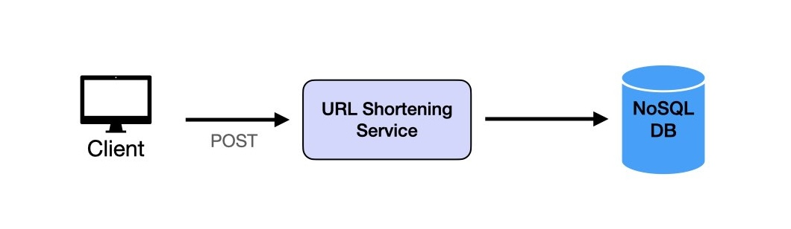
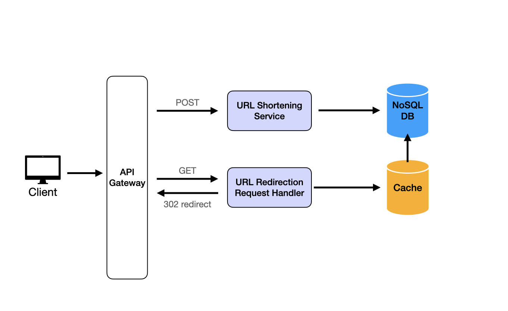
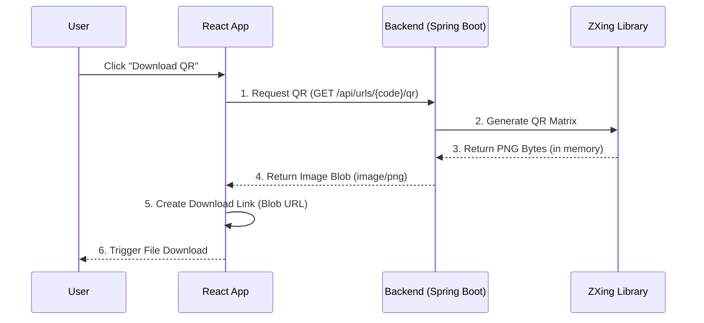

# System Design: URL Shortener Service

## 1. Functional Requirements
- input a URL and return a short URL -> CREATE
- short URL redirect to orginal URL -> READ
- track link -> UPDATE (Analytics)
- Bonus : Generate QR from short URL
- **Out of Scope **: Authenication, Authorization


Scale Requirements 
- 100M Daily Active Users
- Read : write ratio = 100 : 1 
- Data retention for 5 years 
- 1 milion write requests per day 
- entry is about 500 bytes

## 2. Non-Functional Requirements
- Unique alias 
- High traffic - High Durability
- Real Time - Low Latency
- Persistent
## 3. High-Level Architecture
The system is divided into two primary flows based on the "Command Query Responsibility Segregation" (CQRS) concept:

- **Write Flow (Shortening):**
  `Client -> API -> Shorten Service -> ID Generator -> Database`
  
- **Read Flow (Redirection):**
  `Client -> API -> Redirect Service -> Cache (Redis) -> Database (DB)`
  *The cache is the primary data source to ensure <10ms latency.*

- **Create Flow (Generate QR Code)**
 `Client -> API -> QR Service -> QR Generator -> QR Image`
 - QR code must retention for 1 years

## 4. ID Generation Strategy
We avoid database auto-increment to enable horizontal scaling and prevent enumeration attacks.
- **Mechanism:** Custom ID Generator using `MachineID` (for distributed nodes) + `Sequence` (for local ordering).
- **Encoding:** Base62 (a-z, A-Z, 0-9) encoding of the generated numeric ID.
- **Output:** A numeric ID ensures O(1) DB inserts, and Base62 encoding compacts it to ~6 characters.

## 5. Data Model
We use a relational database for ACID compliance, essential for the mapping integrity.

URLMapping
Stores the mapping between short URLs and original URLs. This is the core entity that enables the shortening and redirection operations.


Field Details
Field	Type	Description
short_url	string	Primary key. Base62 encoded unique identifier (6 characters). Example "a1B2c3"
original_url	string	The destination URL that the short URL redirects to
created_at	timestamp	When the URL was shortened. Used for analytics and expiration policies


Analytics
Tracks access metrics for each shortened URL. Supports the link tracking functional requirement.


Field Details
Field	Type	Description
short_url	string	Foreign key to URLMapping. Links analytics data to the shortened URL
click_count	integer	Total number of times this short URL has been accessed
last_accessed	timestamp	Most recent access timestamp for staleness detection

## 6. API Endpoints

### Public API (Short & Fast)
| Method | Endpoint | Description |
|--------|----------|-------------|
| GET | `/{short_code}` | Redirect to original URL (302) |

### Management API
| Method | Endpoint | Description |
|--------|----------|-------------|
| POST | `/api/urls/shorten` | Create short URL |
| GET | `/api/urls/{short_code}/analytics` | Get click stats |
| POST | `/api/urls/{short_code}/qr` | Generate QR code |

### Admin API (Future)
| Method | Endpoint | Description |
|--------|----------|-------------|
| GET | `/admin/config` | Get system config (domain, etc.) |
| PUT | `/admin/config` | Update system config |

### Request/Response Examples
```json
// POST /api/urls/shorten
// Request
{ "longUrl": "http://example.com" }

// Response
{ "shortUrl": "http://urlshort.ly/abcd" }
```

> **Note:** Domain `urlshort.ly` is stored in **Database** (`SystemConfig` table) for easy update via Admin Dashboard.

---

## 7. High Level Design Diagrams

### 7.1 URL Shortening Flow


### 7.2 URL Redirect Flow


### 7.3 Analytics Flow


### 7.4 QR Code Flow (Generation & Download)

This feature allows users to download a QR code for their shortened link. The challenge is handling file downloads securely without disk I/O.



**How it works:**
1.  **On-the-fly Generation**: We don't save QR images to disk. We generate them instantly in memory using **ZXing** library.
2.  **Blob Handling**: The frontend receives binary data (Blob), creates a temporary URL (`blob:http://...`), and triggers a download. This avoids CORS issues that happen with standard `<a>` tags.

